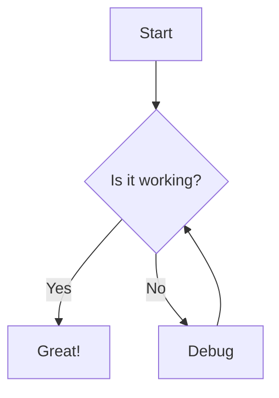
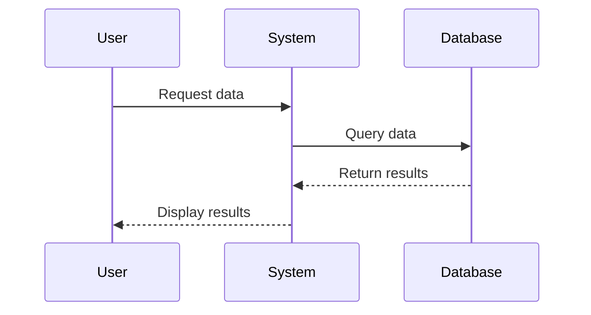
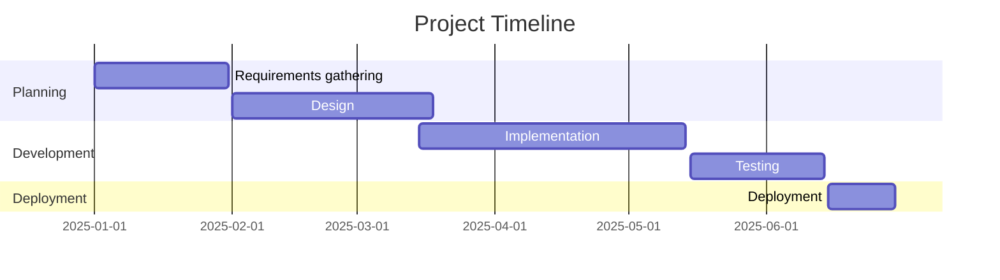

# This is default template for xml composition

# 222222 comp

Created on March 15, 2025 at 8:36:15 PM

## Context Documents

<content title="10-Recipe-Collection">
 
# Culinary Delights: A Recipe Collection

This document showcases various recipe formats, ingredient lists, and cooking instructions to test how the UI handles culinary content.

## Table of Contents

1. [Breakfast](#breakfast)
   - [Fluffy Pancakes](#fluffy-pancakes)
   - [Avocado Toast](#avocado-toast)
2. [Main Courses](#main-courses)
   - [Spaghetti Carbonara](#spaghetti-carbonara)
   - [Thai Green Curry](#thai-green-curry)
3. [Desserts](#desserts)
   - [Chocolate Soufflé](#chocolate-soufflé)
   - [Apple Pie](#apple-pie)
4. [Conversion Charts](#conversion-charts)

## Breakfast

### Fluffy Pancakes


**Ingredients:**
- 2 cups all-purpose flour
- 2 tablespoons sugar
- 1 tablespoon baking powder
- ½ teaspoon salt
- 2 large eggs
- 1¾ cups milk
- ¼ cup melted butter
- 1 teaspoon vanilla extract

**Instructions:**
1. In a large bowl, whisk together the flour, sugar, baking powder, and salt.
2. In another bowl, beat the eggs, then add milk, melted butter, and vanilla.
3. Pour the wet ingredients into the dry ingredients and stir just until combined. (Do not overmix; lumps are okay)
4. Heat a griddle or non-stick pan over medium heat. Lightly grease with butter or oil.
5. Pour ¼ cup of batter onto the griddle for each pancake.
6. Cook until bubbles form on the surface, then flip and cook until golden brown.
7. Serve with maple syrup, fresh berries, or whipped cream.

**Nutrition Information:**
| Nutrient | Amount per Serving |
|----------|-------------------|
| Calories | 210 |
| Protein | 6g |
| Carbohydrates | 30g |
| Fat | 8g |
| Fiber | 1g |

### Avocado Toast

**Ingredients:**
- 2 slices whole grain bread
- 1 ripe avocado
- 2 eggs (optional)
- Salt and pepper to taste
- Red pepper flakes (optional)
- Lemon juice
- Extra virgin olive oil

**Instructions:**
1. Toast the bread until golden and firm.
2. While the bread is toasting, mash the avocado in a bowl with a fork. Add salt, pepper, and a squeeze of lemon juice.
3. If using eggs, cook them to your preference (poached, fried, or scrambled).
4. Spread the mashed avocado on the toast.
5. Top with eggs if using.
6. Sprinkle with additional salt, pepper, and red pepper flakes.
7. Drizzle with olive oil before serving.

> **Quick Tip:** For a dairy-free option, skip the eggs and add sliced tomatoes and microgreens on top.

## Main Courses

### Spaghetti Carbonara

**Ingredients:**
- 1 pound (450g) spaghetti
- 8 ounces (225g) pancetta or guanciale, diced
- 4 large eggs
- 1 cup (100g) grated Pecorino Romano cheese
- 1 cup (100g) grated Parmigiano-Reggiano cheese
- Freshly ground black pepper
- Salt for pasta water

**Instructions:**
1. Bring a large pot of salted water to a boil. Add the spaghetti and cook until al dente.
2. While the pasta is cooking, heat a large skillet over medium heat. Add the pancetta and cook until crispy, about 5-7 minutes.
3. In a bowl, whisk together the eggs, both cheeses, and plenty of black pepper.
4. Reserve 1 cup of pasta water, then drain the pasta.
5. Working quickly, add the hot pasta to the skillet with the pancetta. Toss to combine.
6. Remove the skillet from heat and add the egg and cheese mixture, stirring quickly to create a creamy sauce. Add pasta water as needed to reach desired consistency.
7. Serve immediately with additional grated cheese and black pepper.

**Wine Pairing:** Pinot Grigio or Frascati

### Thai Green Curry

**Ingredients:**
- 2 tablespoons vegetable oil
- 2-3 tablespoons Thai green curry paste
- 1 pound (450g) boneless chicken thighs, cut into chunks
- 1 can (14 oz/400ml) coconut milk
- 1 cup chicken broth
- 1 tablespoon fish sauce
- 1 tablespoon palm sugar or brown sugar
- 1 red bell pepper, sliced
- 1 zucchini, sliced
- 1 cup snap peas
- ½ cup Thai basil leaves
- 2 kaffir lime leaves
- Lime wedges for serving
- Steamed jasmine rice for serving

**Instructions:**
1. Heat oil in a large pot or wok over medium heat. Add the curry paste and stir-fry for 1 minute until fragrant.
2. Add chicken and cook until no longer pink on the outside, about 3-4 minutes.
3. Pour in coconut milk and chicken broth. Bring to a simmer.
4. Add fish sauce and sugar, stirring to combine.
5. Add bell pepper, zucchini, and snap peas. Simmer for 10-15 minutes until vegetables are tender and chicken is cooked through.
6. Stir in Thai basil and lime leaves.
7. Serve hot over steamed jasmine rice with lime wedges on the side.

**Spice Level Adjustment:**
- Mild: 1 tablespoon curry paste
- Medium: 2 tablespoons curry paste
- Hot: 3+ tablespoons curry paste

## Desserts

### Chocolate Soufflé

**Ingredients:**
- Butter for greasing ramekins
- ¼ cup granulated sugar, plus extra for ramekins
- 8 ounces (225g) bittersweet chocolate, chopped
- 1 tablespoon vanilla extract
- 3 tablespoons all-purpose flour
- 1½ cups whole milk
- 6 large eggs, separated
- ¼ teaspoon cream of tartar
- Pinch of salt
- Powdered sugar for dusting

**Instructions:**
1. Preheat oven to 375°F (190°C). Butter six 6-ounce ramekins and coat with sugar.
2. Melt chocolate in a double boiler or microwave. Set aside to cool slightly.
3. In a medium saucepan, heat milk until simmering.
4. In a separate bowl, whisk egg yolks with 2 tablespoons of sugar until pale. Add flour and whisk until smooth.
5. Slowly pour hot milk into egg mixture, whisking constantly.
6. Return mixture to saucepan and cook over medium heat, stirring constantly, until thickened.
7. Remove from heat and stir in melted chocolate and vanilla.
8. In a clean bowl, beat egg whites with cream of tartar and salt until foamy. Gradually add remaining sugar and beat until stiff peaks form.
9. Gently fold egg whites into chocolate mixture in three additions.
10. Fill ramekins to the top and smooth surfaces.
11. Bake for 18-20 minutes until soufflés have risen and tops are set.
12. Dust with powdered sugar and serve immediately.

```
                    ⭐ CHEF'S NOTE ⭐
The key to a successful soufflé is not overmixing when folding
in the egg whites. Be gentle to maintain as much air as possible
in the mixture.
```

### Apple Pie

**Ingredients:**

*For the crust:*
- 2½ cups all-purpose flour
- 1 teaspoon salt
- 1 tablespoon sugar
- 1 cup cold unsalted butter, cubed
- ¼ to ½ cup ice water

*For the filling:*
- 8 cups thinly sliced apples (mix of Granny Smith and Honeycrisp)
- ¾ cup granulated sugar
- 2 tablespoons all-purpose flour
- 1 teaspoon ground cinnamon
- ¼ teaspoon ground nutmeg
- ¼ teaspoon ground allspice
- 2 tablespoons lemon juice
- 2 tablespoons butter, cut into small pieces
- 1 egg, beaten with 1 tablespoon water (for egg wash)
- Coarse sugar for sprinkling

**Instructions:**

*For the crust:*
1. In a food processor, combine flour, salt, and sugar. Pulse to mix.
2. Add butter and pulse until mixture resembles coarse crumbs.
3. Slowly add ice water, 1 tablespoon at a time, pulsing until dough begins to form.
4. Divide dough in half, shape into discs, wrap in plastic, and refrigerate for at least 1 hour.

*For the filling:*
1. In a large bowl, combine sliced apples, sugar, flour, spices, and lemon juice. Toss to coat.

*Assembly:*
1. Preheat oven to 425°F (220°C).
2. Roll out one disc of dough on a floured surface to fit a 9-inch pie dish. Place in dish.
3. Fill with apple mixture. Dot with butter pieces.
4. Roll out second disc of dough. Either place on top as a full crust with slits cut for venting, or cut into strips for a lattice pattern.
5. Seal and crimp edges.
6. Brush with egg wash and sprinkle with coarse sugar.
7. Bake for 45-50 minutes until crust is golden and filling is bubbly.
8. Cool on a wire rack for at least 2 hours before serving.

## Conversion Charts

### Volume Conversions

| US | Metric |
|----|--------|
| 1 teaspoon | 5 ml |
| 1 tablespoon | 15 ml |
| 1 fluid ounce | 30 ml |
| 1 cup | 240 ml |
| 1 pint | 470 ml |
| 1 quart | 950 ml |
| 1 gallon | 3.8 L |

### Weight Conversions

| US | Metric |
|----|--------|
| 1 ounce | 28 g |
| 1 pound | 454 g |

### Temperature Conversions

| Fahrenheit | Celsius |
|------------|---------|
| 32°F | 0°C |
| 212°F | 100°C |
| 350°F | 177°C |
| 375°F | 190°C |
| 400°F | 204°C |
| 425°F | 218°C |
| 450°F | 232°C |

### Common Substitutions

- 1 tablespoon fresh herbs = 1 teaspoon dried herbs
- 1 cup whole milk = ½ cup evaporated milk + ½ cup water
- 1 cup buttermilk = 1 cup milk + 1 tablespoon lemon juice or vinegar
- 1 cup self-rising flour = 1 cup all-purpose flour + 1½ teaspoons baking powder + ¼ teaspoon salt

## Recipe Index

- [[#Fluffy Pancakes|Fluffy Pancakes]]
- [[#Avocado Toast|Avocado Toast]]
- [[#Spaghetti Carbonara|Spaghetti Carbonara]]
- [[#Thai Green Curry|Thai Green Curry]]
- [[#Chocolate Soufflé|Chocolate Soufflé]]
- [[#Apple Pie|Apple Pie]]

---

*All recipes in this collection are for testing purposes and have been adapted from various sources.*

</content>
<content title="11-Programming-Guide">
 
# The Programmer's Notebook

This document contains various programming examples, algorithms, and code snippets in different languages to test how the UI handles code formatting, syntax highlighting, and technical content.

## Table of Contents

1. [Basic Algorithms](#basic-algorithms)
2. [Data Structures](#data-structures)
3. [Design Patterns](#design-patterns)
4. [Language-Specific Examples](#language-specific-examples)
5. [API Integration Examples](#api-integration-examples)
6. [Performance Optimization](#performance-optimization)

## Basic Algorithms

### Fibonacci Sequence

The Fibonacci sequence is a series of numbers where each number is the sum of the two preceding ones, usually starting with 0 and 1.

#### Recursive Implementation (JavaScript)

```javascript
function fibonacci(n) {
    // Base cases
    if (n <= 0) return 0;
    if (n === 1) return 1;
    
    // Recursive case
    return fibonacci(n - 1) + fibonacci(n - 2);
}

// Example usage
console.log(fibonacci(10)); // Output: 55
```

#### Dynamic Programming Implementation (Python)

```python
def fibonacci_dp(n):
    # Initialize array to store Fibonacci numbers
    fib = [0] * (n + 1)
    
    # Base cases
    fib[0] = 0
    if n > 0:
        fib[1] = 1
    
    # Build up the array
    for i in range(2, n + 1):
        fib[i] = fib[i - 1] + fib[i - 2]
    
    return fib[n]

# Example usage
print(fibonacci_dp(10))  # Output: 55
```

### Sorting Algorithms

#### Quick Sort (Java)

```java
public class QuickSort {
    public static void quickSort(int[] arr, int low, int high) {
        if (low < high) {
            // Find the partition index
            int pi = partition(arr, low, high);
            
            // Recursively sort elements before and after partition
            quickSort(arr, low, pi - 1);
            quickSort(arr, pi + 1, high);
        }
    }
    
    private static int partition(int[] arr, int low, int high) {
        // Choose the rightmost element as pivot
        int pivot = arr[high];
        
        // Index of smaller element
        int i = (low - 1);
        
        for (int j = low; j < high; j++) {
            // If current element is smaller than the pivot
            if (arr[j] < pivot) {
                i++;
                
                // Swap arr[i] and arr[j]
                int temp = arr[i];
                arr[i] = arr[j];
                arr[j] = temp;
            }
        }
        
        // Swap arr[i+1] and arr[high] (or pivot)
        int temp = arr[i + 1];
        arr[i + 1] = arr[high];
        arr[high] = temp;
        
        return i + 1;
    }
    
    // Example usage
    public static void main(String[] args) {
        int[] arr = {10, 7, 8, 9, 1, 5};
        quickSort(arr, 0, arr.length - 1);
        
        for (int num : arr) {
            System.out.print(num + " ");
        }
        // Output: 1 5 7 8 9 10
    }
}
```

## Data Structures

### Linked List Implementation (C++)

```cpp
#include <iostream>

class Node {
public:
    int data;
    Node* next;
    
    Node(int val) : data(val), next(nullptr) {}
};

class LinkedList {
private:
    Node* head;
    
public:
    LinkedList() : head(nullptr) {}
    
    // Add a new node at the front
    void push_front(int new_data) {
        Node* new_node = new Node(new_data);
        new_node->next = head;
        head = new_node;
    }
    
    // Add a new node after a given node
    void insert_after(Node* prev_node, int new_data) {
        if (prev_node == nullptr) {
            std::cout << "The given previous node cannot be NULL";
            return;
        }
        
        Node* new_node = new Node(new_data);
        new_node->next = prev_node->next;
        prev_node->next = new_node;
    }
    
    // Add a new node at the end
    void push_back(int new_data) {
        Node* new_node = new Node(new_data);
        
        if (head == nullptr) {
            head = new_node;
            return;
        }
        
        Node* last = head;
        while (last->next != nullptr) {
            last = last->next;
        }
        
        last->next = new_node;
    }
    
    // Delete a node with given key
    void remove(int key) {
        Node* temp = head;
        Node* prev = nullptr;
        
        // If head node itself holds the key to be deleted
        if (temp != nullptr && temp->data == key) {
            head = temp->next;
            delete temp;
            return;
        }
        
        // Search for the key to be deleted
        while (temp != nullptr && temp->data != key) {
            prev = temp;
            temp = temp->next;
        }
        
        // If key was not present in linked list
        if (temp == nullptr) return;
        
        // Unlink the node from linked list
        prev->next = temp->next;
        delete temp;
    }
    
    // Print the linked list
    void print_list() {
        Node* node = head;
        while (node != nullptr) {
            std::cout << node->data << " ";
            node = node->next;
        }
        std::cout << std::endl;
    }
    
    // Destructor to free memory
    ~LinkedList() {
        Node* current = head;
        Node* next = nullptr;
        
        while (current != nullptr) {
            next = current->next;
            delete current;
            current = next;
        }
        
        head = nullptr;
    }
};

// Example usage
int main() {
    LinkedList list;
    
    list.push_back(1);
    list.push_front(2);
    list.push_back(3);
    list.push_front(4);
    list.insert_after(list.head->next, 5);
    
    std::cout << "Linked List: ";
    list.print_list();  // Output: 4 2 5 1 3
    
    list.remove(5);
    std::cout << "After removing 5: ";
    list.print_list();  // Output: 4 2 1 3
    
    return 0;
}
```

### Binary Search Tree (TypeScript)

```typescript
class TreeNode {
    value: number;
    left: TreeNode | null;
    right: TreeNode | null;
    
    constructor(value: number) {
        this.value = value;
        this.left = null;
        this.right = null;
    }
}

class BinarySearchTree {
    root: TreeNode | null;
    
    constructor() {
        this.root = null;
    }
    
    insert(value: number): BinarySearchTree {
        const newNode = new TreeNode(value);
        
        if (this.root === null) {
            this.root = newNode;
            return this;
        }
        
        let current = this.root;
        
        while (true) {
            if (value === current.value) return this;
            
            if (value < current.value) {
                if (current.left === null) {
                    current.left = newNode;
                    return this;
                }
                current = current.left;
            } else {
                if (current.right === null) {
                    current.right = newNode;
                    return this;
                }
                current = current.right;
            }
        }
    }
    
    find(value: number): TreeNode | null {
        if (this.root === null) return null;
        
        let current = this.root;
        let found = false;
        
        while (current && !found) {
            if (value < current.value) {
                current = current.left;
            } else if (value > current.value) {
                current = current.right;
            } else {
                found = true;
            }
        }
        
        if (!found) return null;
        return current;
    }
    
    // Breadth-first search
    bfs(): number[] {
        const data: number[] = [];
        const queue: TreeNode[] = [];
        let node: TreeNode | null = this.root;
        
        if (node) queue.push(node);
        
        while (queue.length) {
            node = queue.shift() || null;
            
            if (node) {
                data.push(node.value);
                if (node.left) queue.push(node.left);
                if (node.right) queue.push(node.right);
            }
        }
        
        return data;
    }
    
    // Depth-first search - preorder
    dfsPreOrder(): number[] {
        const data: number[] = [];
        
        function traverse(node: TreeNode | null) {
            if (node) {
                data.push(node.value);
                if (node.left) traverse(node.left);
                if (node.right) traverse(node.right);
            }
        }
        
        traverse(this.root);
        return data;
    }
    
    // Depth-first search - inorder
    dfsInOrder(): number[] {
        const data: number[] = [];
        
        function traverse(node: TreeNode | null) {
            if (node) {
                if (node.left) traverse(node.left);
                data.push(node.value);
                if (node.right) traverse(node.right);
            }
        }
        
        traverse(this.root);
        return data;
    }
    
    // Depth-first search - postorder
    dfsPostOrder(): number[] {
        const data: number[] = [];
        
        function traverse(node: TreeNode | null) {
            if (node) {
                if (node.left) traverse(node.left);
                if (node.right) traverse(node.right);
                data.push(node.value);
            }
        }
        
        traverse(this.root);
        return data;
    }
}

// Example usage
const bst = new BinarySearchTree();
bst.insert(10);
bst.insert(6);
bst.insert(15);
bst.insert(3);
bst.insert(8);
bst.insert(20);

console.log(bst.bfs());         // [10, 6, 15, 3, 8, 20]
console.log(bst.dfsPreOrder()); // [10, 6, 3, 8, 15, 20]
console.log(bst.dfsInOrder());  // [3, 6, 8, 10, 15, 20]
console.log(bst.dfsPostOrder());// [3, 8, 6, 20, 15, 10]
```

## Design Patterns

### Singleton Pattern (Python)

```python
class Singleton:
    _instance = None
    
    def __new__(cls):
        if cls._instance is None:
            cls._instance = super(Singleton, cls).__new__(cls)
            cls._instance.initialize()
        return cls._instance
    
    def initialize(self):
        self.value = 0
    
    def increment(self):
        self.value += 1
        return self.value

# Example usage
s1 = Singleton()
s2 = Singleton()

print(s1 is s2)  # Output: True (both variables reference the same instance)

s1.increment()
print(s2.value)  # Output: 1 (changes to s1 affect s2 because they're the same object)
```

### Observer Pattern (JavaScript)

```javascript
class Subject {
    constructor() {
        this.observers = [];
    }
    
    subscribe(observer) {
        this.observers.push(observer);
    }
    
    unsubscribe(observer) {
        this.observers = this.observers.filter(obs => obs !== observer);
    }
    
    notify(data) {
        this.observers.forEach(observer => observer.update(data));
    }
}

class Observer {
    constructor(name) {
        this.name = name;
    }
    
    update(data) {
        console.log(`${this.name} received update: ${data}`);
    }
}

// Example usage
const subject = new Subject();

const observer1 = new Observer('Observer 1');
const observer2 = new Observer('Observer 2');

subject.subscribe(observer1);
subject.subscribe(observer2);

subject.notify('Hello World!');
// Output:
// Observer 1 received update: Hello World!
// Observer 2 received update: Hello World!

subject.unsubscribe(observer1);
subject.notify('Another update');
// Output:
// Observer 2 received update: Another update
```

## Language-Specific Examples

### Asynchronous Programming in JavaScript

```javascript
// Using Promises
function fetchDataWithPromise(url) {
    return fetch(url)
        .then(response => {
            if (!response.ok) {
                throw new Error(`HTTP error! status: ${response.status}`);
            }
            return response.json();
        })
        .then(data => {
            console.log('Data fetched successfully:', data);
            return data;
        })
        .catch(error => {
            console.error('Error fetching data:', error);
            throw error;
        });
}

// Using async/await
async function fetchDataWithAsync(url) {
    try {
        const response = await fetch(url);
        
        if (!response.ok) {
            throw new Error(`HTTP error! status: ${response.status}`);
        }
        
        const data = await response.json();
        console.log('Data fetched successfully:', data);
        return data;
    } catch (error) {
        console.error('Error fetching data:', error);
        throw error;
    }
}

// Example usage
fetchDataWithPromise('https://api.example.com/data')
    .then(data => console.log('Processing data:', data.length))
    .catch(error => console.log('Handling error:', error.message));

// Using async/await with IIFE
(async () => {
    try {
        const data = await fetchDataWithAsync('https://api.example.com/data');
        console.log('Processing data:', data.length);
    } catch (error) {
        console.log('Handling error:', error.message);
    }
})();
```

### Generics in TypeScript

```typescript
// Generic function
function identity<T>(arg: T): T {
    return arg;
}

const output1 = identity<string>("myString");  // type of output will be 'string'
const output2 = identity<number>(100);         // type of output will be 'number'

// Generic interface
interface GenericIdentityFn<T> {
    (arg: T): T;
}

function identity2<T>(arg: T): T {
    return arg;
}

let myIdentity: GenericIdentityFn<number> = identity2;

// Generic class
class GenericNumber<T> {
    zeroValue: T;
    add: (x: T, y: T) => T;
    
    constructor(zero: T, addFn: (x: T, y: T) => T) {
        this.zeroValue = zero;
        this.add = addFn;
    }
}

// For numbers
const myGenericNumber = new GenericNumber<number>(0, (x, y) => x + y);
console.log(myGenericNumber.add(3, 4));  // Output: 7

// For strings
const stringNumeric = new GenericNumber<string>('', (x, y) => x + y);
console.log(stringNumeric.add("Hello ", "World"));  // Output: Hello World
```

### LINQ in C#

```csharp
using System;
using System.Collections.Generic;
using System.Linq;

class Program
{
    static void Main()
    {
        // Sample data
        List<Person> people = new List<Person>
        {
            new Person { Name = "Alice", Age = 25, City = "New York" },
            new Person { Name = "Bob", Age = 30, City = "Los Angeles" },
            new Person { Name = "Charlie", Age = 35, City = "Chicago" },
            new Person { Name = "Dave", Age = 40, City = "New York" },
            new Person { Name = "Eve", Age = 45, City = "Los Angeles" },
            new Person { Name = "Frank", Age = 50, City = "Chicago" }
        };
        
        // Basic filtering
        var over30 = people.Where(p => p.Age > 30);
        Console.WriteLine("People over 30:");
        foreach (var person in over30)
        {
            Console.WriteLine($"{person.Name}, {person.Age}");
        }
        
        // Ordering
        var orderedByAge = people.OrderBy(p => p.Age);
        Console.WriteLine("\nPeople ordered by age:");
        foreach (var person in orderedByAge)
        {
            Console.WriteLine($"{person.Name}, {person.Age}");
        }
        
        // Grouping
        var groupedByCity = people.GroupBy(p => p.City);
        Console.WriteLine("\nPeople grouped by city:");
        foreach (var group in groupedByCity)
        {
            Console.WriteLine($"City: {group.Key}");
            foreach (var person in group)
            {
                Console.WriteLine($"  {person.Name}, {person.Age}");
            }
        }
        
        // Projection
        var nameAndAge = people.Select(p => new { p.Name, p.Age });
        Console.WriteLine("\nNames and ages:");
        foreach (var item in nameAndAge)
        {
            Console.WriteLine($"{item.Name}, {item.Age}");
        }
        
        // Aggregation
        double averageAge = people.Average(p => p.Age);
        Console.WriteLine($"\nAverage age: {averageAge}");
        
        int maxAge = people.Max(p => p.Age);
        Console.WriteLine($"Maximum age: {maxAge}");
        
        int minAge = people.Min(p => p.Age);
        Console.WriteLine($"Minimum age: {minAge}");
    }
}

class Person
{
    public string Name { get; set; }
    public int Age { get; set; }
    public string City { get; set; }
}
```

## API Integration Examples

### RESTful API with Node.js and Express

```javascript
const express = require('express');
const bodyParser = require('body-parser');

const app = express();
const port = 3000;

// Middleware
app.use(bodyParser.json());

// In-memory database
let users = [
    { id: 1, name: 'John Doe', email: 'john@example.com' },
    { id: 2, name: 'Jane Smith', email: 'jane@example.com' }
];

// Routes
// Get all users
app.get('/api/users', (req, res) => {
    res.json(users);
});

// Get user by ID
app.get('/api/users/:id', (req, res) => {
    const id = parseInt(req.params.id);
    const user = users.find(user => user.id === id);
    
    if (!user) {
        return res.status(404).json({ message: 'User not found' });
    }
    
    res.json(user);
});

// Create a new user
app.post('/api/users', (req, res) => {
    const { name, email } = req.body;
    
    if (!name || !email) {
        return res.status(400).json({ message: 'Name and email are required' });
    }
    
    const newId = users.length > 0 ? Math.max(...users.map(user => user.id)) + 1 : 1;
    
    const newUser = {
        id: newId,
        name,
        email
    };
    
    users.push(newUser);
    
    res.status(201).json(newUser);
});

// Update a user
app.put('/api/users/:id', (req, res) => {
    const id = parseInt(req.params.id);
    const { name, email } = req.body;
    
    const userIndex = users.findIndex(user => user.id === id);
    
    if (userIndex === -1) {
        return res.status(404).json({ message: 'User not found' });
    }
    
    const updatedUser = {
        id,
        name: name || users[userIndex].name,
        email: email || users[userIndex].email
    };
    
    users[userIndex] = updatedUser;
    
    res.json(updatedUser);
});

// Delete a user
app.delete('/api/users/:id', (req, res) => {
    const id = parseInt(req.params.id);
    
    const userIndex = users.findIndex(user => user.id === id);
    
    if (userIndex === -1) {
        return res.status(404).json({ message: 'User not found' });
    }
    
    users = users.filter(user => user.id !== id);
    
    res.json({ message: 'User deleted successfully' });
});

// Start the server
app.listen(port, () => {
    console.log(`Server running at http://localhost:${port}`);
});
```

## Performance Optimization

### Memoization in JavaScript

```javascript
// Fibonacci without memoization (inefficient)
function fibonacciSlow(n) {
    if (n <= 1) return n;
    return fibonacciSlow(n - 1) + fibonacciSlow(n - 2);
}

// Fibonacci with memoization (efficient)
function fibonacciFast(n, memo = {}) {
    if (n in memo) return memo[n];
    if (n <= 1) return n;
    
    memo[n] = fibonacciFast(n - 1, memo) + fibonacciFast(n - 2, memo);
    return memo[n];
}

// Performance comparison
function timeFunction(fn, ...args) {
    const start = performance.now();
    const result = fn(...args);
    const end = performance.now();
    
    console.log(`Execution time: ${end - start} ms`);
    return result;
}

// Example usage
console.log("Fibonacci without memoization:");
timeFunction(fibonacciSlow, 30);  // Will take several seconds

console.log("\nFibonacci with memoization:");
timeFunction(fibonacciFast, 30);  // Will be almost instantaneous

// Generic memoization higher-order function
function memoize(fn) {
    const cache = {};
    
    return function(...args) {
        const key = JSON.stringify(args);
        
        if (key in cache) {
            console.log("Fetching from cache");
            return cache[key];
        }
        
        console.log("Computing result");
        const result = fn.apply(this, args);
        cache[key] = result;
        
        return result;
    };
}

// Example usage of generic memoization
const memoizedFibonacci = memoize(function(n) {
    if (n <= 1) return n;
    return memoizedFibonacci(n - 1) + memoizedFibonacci(n - 2);
});

console.log("\nGeneric memoized fibonacci:");
timeFunction(memoizedFibonacci, 30);  // Will be efficient
```

## Algorithm Complexity Cheat Sheet

| Algorithm | Time Complexity (Average) | Time Complexity (Worst) | Space Complexity |
|-----------|---------------------------|-------------------------|------------------|
| Quick Sort | O(n log n) | O(n²) | O(log n) |
| Merge Sort | O(n log n) | O(n log n) | O(n) |
| Heap Sort | O(n log n) | O(n log n) | O(1) |
| Bubble Sort | O(n²) | O(n²) | O(1) |
| Linear Search | O(n) | O(n) | O(1) |
| Binary Search | O(log n) | O(log n) | O(1) |
| Breadth-First Search | O(V + E) | O(V + E) | O(V) |
| Depth-First Search | O(V + E) | O(V + E) | O(V) |
| Dijkstra's Algorithm | O(V² + E) | O(V² + E) | O(V) |

Where:
- n = number of elements
- V = number of vertices
- E = number of edges

## Programming Resources

- [[#Basic Algorithms|Basic Algorithms]]
- [[#Data Structures|Data Structures]]
- [[#Design Patterns|Design Patterns]]
- [[#Language-Specific Examples|Language-Specific Examples]]
- [[#API Integration Examples|API Integration Examples]]
- [[#Performance Optimization|Performance Optimization]]

---

*This document is for testing purposes and contains code examples from various sources.*

</content>
<content title="12-Multilingual-Content">
 
# Multilingual Content Test

This document tests how the UI handles content in multiple languages, scripts, and writing systems. It includes text in various languages to test rendering, font support, and bidirectional text handling.

## Languages with Latin Script

### English

The quick brown fox jumps over the lazy dog. All human beings are born free and equal in dignity and rights. They are endowed with reason and conscience and should act towards one another in a spirit of brotherhood.

### French (Français)

Le vif renard brun saute par-dessus le chien paresseux. Tous les êtres humains naissent libres et égaux en dignité et en droits. Ils sont doués de raison et de conscience et doivent agir les uns envers les autres dans un esprit de fraternité.

### Spanish (Español)

El rápido zorro marrón salta sobre el perro perezoso. Todos los seres humanos nacen libres e iguales en dignidad y derechos. Están dotados de razón y conciencia y deben comportarse fraternalmente los unos con los otros.

### German (Deutsch)

Der schnelle braune Fuchs springt über den faulen Hund. Alle Menschen sind frei und gleich an Würde und Rechten geboren. Sie sind mit Vernunft und Gewissen begabt und sollen einander im Geist der Brüderlichkeit begegnen.

### Portuguese (Português)

A rápida raposa marrom pula sobre o cão preguiçoso. Todos os seres humanos nascem livres e iguais em dignidade e direitos. São dotados de razão e consciência e devem agir em relação uns aos outros com espírito de fraternidade.

## East Asian Languages

### Chinese Simplified (简体中文)

快速的棕色狐狸跳过懒狗。人人生而自由，在尊严和权利上一律平等。他们赋有理性和良心，并应以兄弟关系的精神相对待。

### Chinese Traditional (繁體中文)

快速的棕色狐狸跳過懶狗。人人生而自由，在尊嚴和權利上一律平等。他們賦有理性和良心，並應以兄弟關係的精神相對待。

### Japanese (日本語)

素早い茶色のキツネは怠け者の犬を飛び越えます。すべての人間は、生まれながらにして自由であり、尊厳と権利について平等である。彼らは理性と良心を授けられており、兄弟愛の精神で互いに行動すべきである。

### Korean (한국어)

빠른 갈색 여우가 게으른 개를 뛰어넘습니다. 모든 인간은 태어날 때부터 자유롭고 존엄성과 권리에 있어서 평등하다. 그들은 이성과 양심을 부여받았으며 서로에게 형제애의 정신으로 행동해야 한다.

## Right-to-Left Languages

### Arabic (العربية)

الثعلب البني السريع يقفز فوق الكلب الكسول. يولد جميع الناس أحرارًا ومتساوين في الكرامة والحقوق. وهم قد وهبوا العقل والوجدان وعليهم أن يعاملوا بعضهم بعضًا بروح الإخاء.

### Hebrew (עברית)

השועל החום המהיר קופץ מעל הכלב העצלן. כל בני האדם נולדו בני חורין ושווים בערכם ובזכויותיהם. הם ניחנו בתבונה ובמצפון, לפיכך חובה עליהם לנהוג איש ברעהו ברוח של אחווה.

### Persian (فارسی)

روباه قهوه‌ای سریع از روی سگ تنبل می‌پرد. همه انسان‌ها آزاد به دنیا می‌آیند و از لحاظ حیثیت و حقوق با هم برابرند. آنها دارای عقل و وجدان هستند و باید با یکدیگر با روحیه برادری رفتار کنند.

## South Asian Scripts

### Hindi (हिन्दी)

तेज भूरी लोमड़ी आलसी कुत्ते के ऊपर से कूदती है। सभी मनुष्य जन्म से स्वतंत्र और गरिमा और अधिकारों के मामले में समान होते हैं। उन्हें तर्क और विवेक से संपन्न किया गया है और उन्हें भाईचारे की भावना से एक दूसरे के प्रति कार्य करना चाहिए।

### Bengali (বাংলা)

দ্রুত বাদামী শিয়াল অলস কুকুরের উপর দিয়ে লাফিয়ে যায়। সমস্ত মানুষ স্বাধীনভাবে জন্মগ্রহণ করে এবং মর্যাদা ও অধিকারে সমান। তাদের বিবেক এবং বিবেক দেওয়া হয়েছে এবং তাদের একে অপরের প্রতি ভ্রাতৃত্বের মনোভাব নিয়ে কাজ করা উচিত।

### Tamil (தமிழ்)

விரைவான பழுப்பு நரி சோம்பேறி நாய் மீது தாவுகிறது. அனைத்து மனிதர்களும் சுதந்திரமாகவும், கண்ணியத்திலும் உரிமைகளிலும் சமமாகவும் பிறக்கிறார்கள். அவர்கள் பகுத்தறிவும் மனசாட்சியும் கொண்டவர்கள், மேலும் ஒருவருக்கொருவர் சகோதரத்துவ உணர்வுடன் நடந்துகொள்ள வேண்டும்.

### Thai (ไทย)

จิ้งจอกสีน้ำตาลตัวที่ว่องไวกระโดดข้ามสุนัขขี้เกียจ มนุษย์ทุกคนเกิดมาอย่างอิสระและเท่าเทียมกันในศักดิ์ศรีและสิทธิ พวกเขาได้รับการประสิทธิ์ประสาทด้วยเหตุผลและมโนธรรม และควรปฏิบัติต่อกันด้วยจิตวิญญาณแห่งภราดรภาพ

## Mixed Content and Special Cases

### Mixed Direction Text

This is English text followed by Arabic: الثعلب البني السريع and then back to English.

Hebrew text: עברית followed by English followed by more Hebrew: שלום

### Mixed Script Paragraph

This paragraph contains multiple scripts: Latin (English), Cyrillic (Русский), Greek (Ελληνικά), Arabic (العربية), and Devanagari (हिन्दी) all in one paragraph. It tests how the UI handles mixed script rendering and line breaking across different writing systems.

### Special Characters and Symbols

#### Mathematical Symbols

∀x∈ℝ: x² ≥ 0
∮ E⋅da = Q/ε₀
∇ × B = μ₀J + μ₀ε₀∂E/∂t

#### Phonetic Symbols (IPA)

[ðə kwɪk braʊn fɒks ʤʌmps ˈəʊvə ðə leɪzi dɒg]

#### Musical Notation

♩ ♪ ♫ ♬ 𝄞 𝄢 𝄪 𝄫

#### Emoji with Text

I 😍 multilingual content! It's 🔥 to test with different languages 🌎.

## Bidirectional Text Challenges

### Nested RTL in LTR

English text with (Arabic phrase الثعلب البني in parentheses) followed by more English.

### Nested LTR in RTL

النص العربي مع (English phrase inside parentheses) ثم المزيد من النص العربي.

### Bidirectional with Numbers and Punctuation

The price is 1,234.56€ in English, but in Arabic it's ١٬٢٣٤٫٥٦€ العملة.

## Complex Formatting with Multilingual Content

### Tables with Multiple Languages

| Language | Hello | Thank you | Goodbye |
|----------|-------|-----------|---------|
| English | Hello | Thank you | Goodbye |
| Spanish | Hola | Gracias | Adiós |
| French | Bonjour | Merci | Au revoir |
| Japanese | こんにちは | ありがとう | さようなら |
| Arabic | مرحبا | شكرا | وداعا |
| Russian | Здравствуйте | Спасибо | До свидания |

### Code with Comments in Different Languages

```python
# English comment
print("Hello, World!")

# Comentario en español
print("¡Hola, Mundo!")

# Commentaire en français
print("Bonjour, le Monde!")

# 日本語のコメント
print("こんにちは、世界！")

# تعليق بالعربية
print("مرحبا بالعالم!")
```

### Lists with Multiple Languages

1. English: The quick brown fox jumps over the lazy dog.
2. Français: Le vif renard brun saute par-dessus le chien paresseux.
3. Español: El rápido zorro marrón salta sobre el perro perezoso.
4. 日本語: 素早い茶色のキツネは怠け者の犬を飛び越えます。
5. العربية: الثعلب البني السريع يقفز فوق الكلب الكسول.

## Language Resources

- [[#Languages with Latin Script|European Languages]]
- [[#East Asian Languages|Asian Languages]]
- [[#Right-to-Left Languages|RTL Languages]]
- [[#South Asian Scripts|South Asian Languages]]
- [[#Mixed Content and Special Cases|Mixed Content Examples]]

---

*This document is for testing purposes and contains text in multiple languages to test UI rendering capabilities.*

</content>
<content title="13-Visual-Layout-Test">
 
# Visual Layout and Formatting Test

This document tests how the UI handles various visual layouts, alignments, and complex formatting structures.

## Text Alignment

### Left Alignment (Default)
This text is left-aligned, which is the default for most markdown renderers.
It should align with the left margin of the document.
Multiple lines should all start at the same left position.

### Center Alignment (if supported)
<div align="center">
This text should be center-aligned if the renderer supports HTML alignment tags.
Each line should be centered relative to the document width.
This tests how the UI handles centered text blocks.
</div>

### Right Alignment (if supported)
<div align="right">
This text should be right-aligned if the renderer supports HTML alignment tags.
Each line should align with the right margin of the document.
This tests how the UI handles right-aligned text blocks.
</div>

### Justified Text (if supported)
<div style="text-align: justify;">
This paragraph should have justified text if the renderer supports this styling. Justified text aligns to both the left and right margins, creating a clean edge on both sides. This is commonly used in books, newspapers, and magazines to create a more formal look. This paragraph is intentionally long to demonstrate the effect of justification across multiple lines of text. The spacing between words is adjusted to ensure that each line reaches both margins except for the last line of the paragraph.
</div>

## Indentation and Margins

### Blockquotes with Varying Depths
> First level of indentation
>> Second level of indentation
>>> Third level of indentation
>>>> Fourth level of indentation
>>>>> Fifth level of indentation

### Mixed Indentation
> Blockquote with a list inside:
> - Item 1
> - Item 2
>   - Nested item 2.1
>   - Nested item 2.2
> - Item 3
> 
> And a code block inside:
> ```
> function test() {
>   console.log("Code inside blockquote");
> }
> ```

## Columns and Multi-Column Layout (if supported)

<div style="column-count: 2; column-gap: 40px;">
This text should be displayed in a two-column layout if the renderer supports CSS columns. This tests how the UI handles multi-column text flows. The text should flow from the top of the first column to the bottom, then continue at the top of the second column.

Lorem ipsum dolor sit amet, consectetur adipiscing elit. Nullam auctor, nisl eget ultricies tincidunt, nisl nisl aliquam nisl, eget aliquam nisl nisl eget nisl. Nullam auctor, nisl eget ultricies tincidunt, nisl nisl aliquam nisl, eget aliquam nisl nisl eget nisl.

Pellentesque habitant morbi tristique senectus et netus et malesuada fames ac turpis egestas. Vestibulum tortor quam, feugiat vitae, ultricies eget, tempor sit amet, ante. Donec eu libero sit amet quam egestas semper. Aenean ultricies mi vitae est. Mauris placerat eleifend leo.
</div>

<div style="column-count: 3; column-gap: 20px; margin-top: 20px;">
This text should be displayed in a three-column layout. This tests how the UI handles more complex multi-column arrangements. Each column should be narrower than in the two-column layout above.

Sed ut perspiciatis unde omnis iste natus error sit voluptatem accusantium doloremque laudantium, totam rem aperiam, eaque ipsa quae ab illo inventore veritatis et quasi architecto beatae vitae dicta sunt explicabo.

Nemo enim ipsam voluptatem quia voluptas sit aspernatur aut odit aut fugit, sed quia consequuntur magni dolores eos qui ratione voluptatem sequi nesciunt.

Neque porro quisquam est, qui dolorem ipsum quia dolor sit amet, consectetur, adipisci velit, sed quia non numquam eius modi tempora incidunt ut labore et dolore magnam aliquam quaerat voluptatem.
</div>

## Grid Layouts (if supported)

<div style="display: grid; grid-template-columns: 1fr 1fr; grid-gap: 20px;">
  <div style="background-color: #f0f0f0; padding: 10px;">
    <h3>Grid Cell 1</h3>
    <p>This is the content for grid cell 1. It should appear in the first column of a two-column grid.</p>
  </div>
  <div style="background-color: #f0f0f0; padding: 10px;">
    <h3>Grid Cell 2</h3>
    <p>This is the content for grid cell 2. It should appear in the second column of a two-column grid.</p>
  </div>
  <div style="background-color: #f0f0f0; padding: 10px;">
    <h3>Grid Cell 3</h3>
    <p>This is the content for grid cell 3. It should appear in the first column of the second row.</p>
  </div>
  <div style="background-color: #f0f0f0; padding: 10px;">
    <h3>Grid Cell 4</h3>
    <p>This is the content for grid cell 4. It should appear in the second column of the second row.</p>
  </div>
</div>

## Flexbox Layout (if supported)

<div style="display: flex; flex-wrap: wrap; gap: 10px;">
  <div style="flex: 1; min-width: 200px; background-color: #e0e0e0; padding: 10px;">
    <h3>Flex Item 1</h3>
    <p>This is a flexible box item that should resize based on available space.</p>
  </div>
  <div style="flex: 1; min-width: 200px; background-color: #e0e0e0; padding: 10px;">
    <h3>Flex Item 2</h3>
    <p>This is another flexible box item that should resize based on available space.</p>
  </div>
  <div style="flex: 1; min-width: 200px; background-color: #e0e0e0; padding: 10px;">
    <h3>Flex Item 3</h3>
    <p>This is a third flexible box item that should resize based on available space.</p>
  </div>
</div>

## Text Wrapping Around Images (if supported)

<div>
  
  <p>This text should wrap around the image on the left if the renderer supports CSS floating. This tests how the UI handles text flow around floating elements. The text should continue to wrap around the image until it extends past the bottom of the image, at which point it should return to using the full width of the container. This paragraph is intentionally long to demonstrate the wrapping behavior.</p>
</div>

<div style="clear: both; margin-top: 20px;">
  
  <p>This text should wrap around the image on the right if the renderer supports CSS floating. This tests how the UI handles text flow around floating elements positioned on the right side. The text should continue to wrap around the image until it extends past the bottom of the image, at which point it should return to using the full width of the container. This paragraph is intentionally long to demonstrate the wrapping behavior.</p>
</div>

## Complex Nested Structures

### Nested Tables

<table>
  <tr>
    <th>Header 1</th>
    <th>Header 2</th>
    <th>Header 3</th>
  </tr>
  <tr>
    <td>
      <table>
        <tr>
          <td>Nested Table Cell 1</td>
          <td>Nested Table Cell 2</td>
        </tr>
        <tr>
          <td>Nested Table Cell 3</td>
          <td>Nested Table Cell 4</td>
        </tr>
      </table>
    </td>
    <td>Regular Cell</td>
    <td>
      <ul>
        <li>List item in table</li>
        <li>Another list item</li>
      </ul>
    </td>
  </tr>
  <tr>
    <td>Cell with code</td>
    <td>
      ```
      function inTable() {
        return true;
      }
      ```
    </td>
    <td>
      > Blockquote in table cell
      > Second line
    </td>
  </tr>
</table>

### Complex List Structures

- Level 1 item
  - Level 2 item
    - Level 3 item
      - Level 4 item
        - Level 5 item
          - Level 6 item
            - Level 7 item
              - Level 8 item
  - Level 2 item with table
    | Col 1 | Col 2 |
    |-------|-------|
    | Data 1 | Data 2 |
  - Level 2 item with code
    ```javascript
    function nestedInList() {
      console.log("This code is nested in a list");
    }
    ```
  - Level 2 item with blockquote
    > This blockquote is nested in a list
    > It has multiple lines
    >> And even a nested blockquote

## Horizontal Spacing and Alignment

### Fixed-Width Monospace Text Blocks

```
Column 1    Column 2    Column 3    Column 4    Column 5
--------    --------    --------    --------    --------
Value 1     Value 2     Value 3     Value 4     Value 5
Longer Val  Short       Medium Val  Very very   Last one
                                    long value
```

### ASCII Art

```
    +-------------+
    |             |
    |  Markdown   |
    |  Renderer   |
    |             |
    +------+------+
           |
           v
    +------+------+
    |             |
    |  Formatted  |
    |  Output     |
    |             |
    +-------------+
```

### Tabs and Spaces Alignment (Monospace)

```
Name        Age     Occupation
----        ---     ----------
John Doe    32      Developer
Jane Smith  28      Designer
Bob Johnson 45      Manager
```

## Text Decorations (if supported)

<span style="text-decoration: underline;">This text should be underlined</span>

<span style="text-decoration: line-through;">This text should have a strikethrough</span>

<span style="text-decoration: overline;">This text should have an overline</span>

<span style="text-decoration: underline overline;">This text should have both underline and overline</span>

## Text Effects (if supported)

<span style="font-size: 1.5em;">Larger text</span>

<span style="font-size: 0.8em;">Smaller text</span>

<span style="color: red;">Red text</span>

<span style="color: blue;">Blue text</span>

<span style="background-color: yellow;">Text with yellow highlight</span>

<span style="text-shadow: 2px 2px 2px #888;">Text with shadow effect</span>

## Responsive Layout Tests

### Wide Content

This is a very long line of text that should test how the UI handles content that exceeds the width of the viewport. It should either wrap to the next line, show a horizontal scrollbar, or handle the overflow in some other way depending on the implementation of the markdown renderer and the CSS styling applied to it.

### Wide Table

| Column 1 | Column 2 | Column 3 | Column 4 | Column 5 | Column 6 | Column 7 | Column 8 | Column 9 | Column 10 | Column 11 | Column 12 |
|----------|----------|----------|----------|----------|----------|----------|----------|----------|-----------|-----------|-----------|
| Data 1   | Data 2   | Data 3   | Data 4   | Data 5   | Data 6   | Data 7   | Data 8   | Data 9   | Data 10   | Data 11   | Data 12   |

### Wide Image


## Print Layout Testing

<div class="page-break-after">
This content should be followed by a page break when printing if the renderer supports CSS page break controls.
</div>

<div class="page-break-before">
This content should be preceded by a page break when printing if the renderer supports CSS page break controls.
</div>

<div class="no-page-break-inside">
This entire block should be kept together on the same page when printing if the renderer supports CSS page break controls. It should not be split across multiple pages.

Lorem ipsum dolor sit amet, consectetur adipiscing elit. Nullam auctor, nisl eget ultricies tincidunt, nisl nisl aliquam nisl, eget aliquam nisl nisl eget nisl.
</div>

## Layout Resources

- [[#Text Alignment|Text Alignment Examples]]
- [[#Indentation and Margins|Indentation Examples]]
- [[#Columns and Multi-Column Layout (if supported)|Column Layout Examples]]
- [[#Grid Layouts (if supported)|Grid Layout Examples]]
- [[#Complex Nested Structures|Complex Structure Examples]]

---

*This document is for testing purposes and contains various layout examples to test UI rendering capabilities.*

</content>
<content title="14-Dynamic-Content-Test">
 
# Dynamic Content and Interactive Elements Test

This document tests how the UI handles dynamic content, interactive elements, and content that might be generated or modified at runtime.

## Template Variables and Expressions

### Basic Variables

Current Date: {{ date }}

Document Title: {{ title }}

Author: {{ author }}

Version: {{ version }}

### Conditional Content


**DRAFT DOCUMENT - NOT FOR DISTRIBUTION**

**FINAL VERSION - APPROVED FOR DISTRIBUTION**


### Loops and Iterations

#### Task List


- [ ] {{ task.name }} (Due: {{ task.dueDate }})


#### Team Members


- **{{ member.name }}** - {{ member.role }}
  - Email: {{ member.email }}
  - Projects: {{ member.projects.join(", ") }}


## Interactive Elements (if supported)

### Checkboxes

- [ ] Unchecked item 1
- [ ] Unchecked item 2
- [x] Checked item 1
- [x] Checked item 2
- [ ] Unchecked item with **formatted** *text*

### Collapsible Sections (if supported)

<details>
<summary>Click to expand this section</summary>

This content should be hidden by default and only shown when the user clicks on the summary.

It can contain any markdown elements:

- Lists
- **Bold text**
- *Italic text*
- `Code blocks`
- And more...

</details>

<details>
<summary>Another expandable section</summary>

This is another expandable section with different content.

```javascript
function expandableCode() {
  console.log("This code is inside an expandable section");
}
```

</details>

### Interactive Calculations (if supported)

Calculate: {{ 5 + 10 * 2 }} = 25

Current timestamp in milliseconds: {{ Date.now() }}

Random number between 1 and 100: {{ Math.floor(Math.random() * 100) + 1 }}

### User Input Fields (if supported)

Name: [                    ]

Email: [                    ]

Feedback:
[                           ]
[                           ]

### Tabs (if supported)

<div class="tabs">
  <div class="tab" data-tab="tab1">Tab 1</div>
  <div class="tab" data-tab="tab2">Tab 2</div>
  <div class="tab" data-tab="tab3">Tab 3</div>
  
  <div class="tab-content" id="tab1">
    <h3>Content for Tab 1</h3>
    <p>This is the content that should be shown when Tab 1 is active.</p>
  </div>
  
  <div class="tab-content" id="tab2">
    <h3>Content for Tab 2</h3>
    <p>This is the content that should be shown when Tab 2 is active.</p>
  </div>
  
  <div class="tab-content" id="tab3">
    <h3>Content for Tab 3</h3>
    <p>This is the content that should be shown when Tab 3 is active.</p>
  </div>
</div>

## Dynamic References

### Table of Contents (auto-generated)

[TOC]

### Footnotes (auto-numbered)

This is text with a footnote[^1].

This is text with another footnote[^2].

This is text with a named footnote[^note].

[^1]: This is the first footnote.
[^2]: This is the second footnote.
[^note]: This is a named footnote.

### Bibliography (auto-formatted)

According to Smith et al. [@Smith2023], the results were significant.

Jones [-@Jones2022] found similar patterns in earlier studies.

Multiple studies [@Smith2023; @Jones2022; @Brown2021] support this conclusion.

## Dynamic Content Generation

### Automatically Generated Tables

| ID | Name | Value | Calculated |
|----|------|-------|------------|

| {{ i }} | Item {{ i }} | {{ i * 10 }} | {{ i * i }} |


### Charts and Graphs (if supported)

```chart
type: bar
labels: [January, February, March, April, May]
series:
  - name: Series 1
    data: [10, 15, 8, 12, 9]
  - name: Series 2
    data: [5, 8, 12, 7, 11]
```

```chart
type: line
labels: [2020, 2021, 2022, 2023, 2024, 2025]
series:
  - name: Revenue
    data: [50, 65, 80, 95, 115, 140]
  - name: Expenses
    data: [45, 55, 65, 75, 85, 95]
```

```chart
type: pie
labels: [Category A, Category B, Category C, Category D]
series: [30, 25, 20, 25]
```

### Mermaid Diagrams (if supported)







## Live Data (if supported)

### Current Time

The current time is: {{ new Date().toLocaleTimeString() }}

### Weather Information

Current temperature in New York: {{ weather.newyork.temperature }}°C

Current temperature in London: {{ weather.london.temperature }}°C

Current temperature in Tokyo: {{ weather.tokyo.temperature }}°C

### Stock Prices

AAPL: ${{ stocks.AAPL }}

MSFT: ${{ stocks.MSFT }}

GOOG: ${{ stocks.GOOG }}

## Content That Updates on Events (if supported)

### Click Counter

Clicks: {{ clickCount }}

<button onclick="incrementClickCount()">Click me</button>

### Text Input Echo

<input type="text" id="echoInput" placeholder="Type something..." onkeyup="updateEcho()">

Echo: <span id="echoOutput"></span>

### Timer

<button onclick="startTimer()">Start Timer</button>
<button onclick="stopTimer()">Stop Timer</button>

Time elapsed: <span id="timerOutput">0</span> seconds

## Embedded Applications (if supported)

### Calculator

<div class="calculator">
  <input type="text" id="calculatorDisplay" readonly>
  <div class="calculator-buttons">
    <button onclick="calculatorClear()">C</button>
    <button onclick="calculatorAppend('7')">7</button>
    <button onclick="calculatorAppend('8')">8</button>
    <button onclick="calculatorAppend('9')">9</button>
    <button onclick="calculatorAppend('+')">+</button>
    <button onclick="calculatorAppend('4')">4</button>
    <button onclick="calculatorAppend('5')">5</button>
    <button onclick="calculatorAppend('6')">6</button>
    <button onclick="calculatorAppend('-')">-</button>
    <button onclick="calculatorAppend('1')">1</button>
    <button onclick="calculatorAppend('2')">2</button>
    <button onclick="calculatorAppend('3')">3</button>
    <button onclick="calculatorAppend('*')">*</button>
    <button onclick="calculatorAppend('0')">0</button>
    <button onclick="calculatorAppend('.')">.</button>
    <button onclick="calculatorCalculate()">=</button>
    <button onclick="calculatorAppend('/')">/</button>
  </div>
</div>

### Todo List

<div class="todo-app">
  <input type="text" id="todoInput" placeholder="Add a new task...">
  <button onclick="addTodo()">Add</button>
  <ul id="todoList">
    <li>
      <input type="checkbox"> Initial task
      <button onclick="removeTodo(this)">Delete</button>
    </li>
  </ul>
</div>

## Dynamic Content Resources

- [[#Template Variables and Expressions|Template Variables]]
- [[#Interactive Elements (if supported)|Interactive Elements]]
- [[#Dynamic References|Dynamic References]]
- [[#Dynamic Content Generation|Content Generation]]
- [[#Live Data (if supported)|Live Data]]

---

*This document is for testing purposes and contains examples of dynamic and interactive content to test UI rendering capabilities.*

</content>
<content title="15-Composition-Templates-Test">
 
# Composition Templates Test

This document tests how the UI handles composition templates, which define the structure and default content for new compositions.

## Basic Composition Template

```yaml
id: template-basic-article
name: Basic Article Template
description: A simple article template with standard sections
version: 1.0.0
createdAt: '2025-03-15T19:30:00.000Z'
updatedAt: '2025-03-15T19:30:00.000Z'
structure:
  - id: section-title
    type: heading
    level: 1
    content: "{{title}}"
    required: true
  - id: section-abstract
    type: paragraph
    content: "{{abstract}}"
    placeholder: "Write a brief summary of your article here..."
    required: true
  - id: section-introduction
    type: heading
    level: 2
    content: "Introduction"
    required: true
  - id: section-introduction-content
    type: paragraph
    content: "{{introduction}}"
    placeholder: "Introduce your topic and provide context..."
    required: true
  - id: section-body
    type: heading
    level: 2
    content: "Main Content"
    required: true
  - id: section-body-content
    type: paragraph
    content: "{{body}}"
    placeholder: "Develop your main arguments or points here..."
    required: true
  - id: section-conclusion
    type: heading
    level: 2
    content: "Conclusion"
    required: true
  - id: section-conclusion-content
    type: paragraph
    content: "{{conclusion}}"
    placeholder: "Summarize your key points and provide closing thoughts..."
    required: true
  - id: section-references
    type: heading
    level: 2
    content: "References"
    required: false
  - id: section-references-content
    type: list
    listType: ordered
    content: "{{references}}"
    placeholder: "List your references here..."
    required: false
defaultValues:
  title: "Untitled Article"
  abstract: ""
  introduction: ""
  body: ""
  conclusion: ""
  references: []
```

## Advanced Composition Template with Nested Sections

```yaml
id: template-research-paper
name: Research Paper Template
description: A comprehensive template for academic research papers
version: 2.1.0
createdAt: '2025-03-15T19:30:00.000Z'
updatedAt: '2025-03-15T19:30:00.000Z'
structure:
  - id: section-title
    type: heading
    level: 1
    content: "{{title}}"
    required: true
  - id: section-authors
    type: paragraph
    content: "{{authors}}"
    placeholder: "Author names and affiliations..."
    required: true
  - id: section-abstract
    type: heading
    level: 2
    content: "Abstract"
    required: true
  - id: section-abstract-content
    type: paragraph
    content: "{{abstract}}"
    placeholder: "Summarize your research in 150-250 words..."
    required: true
    maxLength: 1500
  - id: section-keywords
    type: paragraph
    content: "**Keywords:** {{keywords}}"
    placeholder: "List 4-6 keywords separated by commas..."
    required: true
  - id: section-introduction
    type: heading
    level: 2
    content: "1. Introduction"
    required: true
  - id: section-introduction-content
    type: paragraph
    content: "{{introduction}}"
    placeholder: "Introduce your research topic, context, and objectives..."
    required: true
  - id: section-literature-review
    type: heading
    level: 2
    content: "2. Literature Review"
    required: true
  - id: section-literature-review-content
    type: paragraph
    content: "{{literatureReview}}"
    placeholder: "Review relevant previous research and theoretical framework..."
    required: true
  - id: section-methodology
    type: heading
    level: 2
    content: "3. Methodology"
    required: true
    children:
      - id: section-methodology-participants
        type: heading
        level: 3
        content: "3.1 Participants"
        required: true
      - id: section-methodology-participants-content
        type: paragraph
        content: "{{participants}}"
        placeholder: "Describe the participants in your study..."
        required: true
      - id: section-methodology-materials
        type: heading
        level: 3
        content: "3.2 Materials"
        required: true
      - id: section-methodology-materials-content
        type: paragraph
        content: "{{materials}}"
        placeholder: "Describe the materials used in your study..."
        required: true
      - id: section-methodology-procedure
        type: heading
        level: 3
        content: "3.3 Procedure"
        required: true
      - id: section-methodology-procedure-content
        type: paragraph
        content: "{{procedure}}"
        placeholder: "Describe the procedure followed in your study..."
        required: true
      - id: section-methodology-analysis
        type: heading
        level: 3
        content: "3.4 Data Analysis"
        required: true
      - id: section-methodology-analysis-content
        type: paragraph
        content: "{{dataAnalysis}}"
        placeholder: "Describe your data analysis methods..."
        required: true
  - id: section-results
    type: heading
    level: 2
    content: "4. Results"
    required: true
  - id: section-results-content
    type: paragraph
    content: "{{results}}"
    placeholder: "Present your findings without interpretation..."
    required: true
  - id: section-discussion
    type: heading
    level: 2
    content: "5. Discussion"
    required: true
  - id: section-discussion-content
    type: paragraph
    content: "{{discussion}}"
    placeholder: "Interpret your results and relate them to previous research..."
    required: true
  - id: section-conclusion
    type: heading
    level: 2
    content: "6. Conclusion"
    required: true
  - id: section-conclusion-content
    type: paragraph
    content: "{{conclusion}}"
    placeholder: "Summarize your findings, implications, and suggestions for future research..."
    required: true
  - id: section-references
    type: heading
    level: 2
    content: "References"
    required: true
  - id: section-references-content
    type: custom
    contentType: "references"
    content: "{{references}}"
    placeholder: "List your references in APA format..."
    required: true
  - id: section-appendices
    type: heading
    level: 2
    content: "Appendices"
    required: false
  - id: section-appendices-content
    type: custom
    contentType: "appendices"
    content: "{{appendices}}"
    placeholder: "Include any supplementary materials here..."
    required: false
defaultValues:
  title: "Untitled Research Paper"
  authors: ""
  abstract: ""
  keywords: ""
  introduction: ""
  literatureReview: ""
  participants: ""
  materials: ""
  procedure: ""
  dataAnalysis: ""
  results: ""
  discussion: ""
  conclusion: ""
  references: []
  appendices: []
metadata:
  citationStyle: "APA"
  wordCount: 0
  targetJournal: ""
  submissionDeadline: ""
  reviewStatus: "Draft"
```

## Creative Writing Template with Branching Structure

```yaml
id: template-short-story
name: Short Story Template
description: A template for creative short stories with character and plot development
version: 1.5.0
createdAt: '2025-03-15T19:30:00.000Z'
updatedAt: '2025-03-15T19:30:00.000Z'
structure:
  - id: section-title
    type: heading
    level: 1
    content: "{{title}}"
    required: true
  - id: section-author
    type: paragraph
    content: "By {{author}}"
    required: true
  - id: section-character-profiles
    type: custom
    contentType: "characterProfiles"
    content: "{{characterProfiles}}"
    visible: false
    required: false
  - id: section-plot-outline
    type: custom
    contentType: "plotOutline"
    content: "{{plotOutline}}"
    visible: false
    required: false
  - id: section-setting-description
    type: custom
    contentType: "settingDescription"
    content: "{{settingDescription}}"
    visible: false
    required: false
  - id: section-introduction
    type: heading
    level: 2
    content: "Introduction"
    required: true
  - id: section-introduction-content
    type: paragraph
    content: "{{introduction}}"
    placeholder: "Set the scene and introduce your main character(s)..."
    required: true
  - id: section-rising-action
    type: heading
    level: 2
    content: "Rising Action"
    required: true
  - id: section-rising-action-content
    type: paragraph
    content: "{{risingAction}}"
    placeholder: "Develop the conflict and build tension..."
    required: true
  - id: section-climax
    type: heading
    level: 2
    content: "Climax"
    required: true
  - id: section-climax-content
    type: paragraph
    content: "{{climax}}"
    placeholder: "Present the turning point of your story..."
    required: true
  - id: section-falling-action
    type: heading
    level: 2
    content: "Falling Action"
    required: true
  - id: section-falling-action-content
    type: paragraph
    content: "{{fallingAction}}"
    placeholder: "Show the consequences of the climax..."
    required: true
  - id: section-resolution
    type: heading
    level: 2
    content: "Resolution"
    required: true
  - id: section-resolution-content
    type: paragraph
    content: "{{resolution}}"
    placeholder: "Conclude your story and tie up loose ends..."
    required: true
  - id: section-alternate-endings
    type: heading
    level: 2
    content: "Alternate Endings (Optional)"
    required: false
    conditional:
      field: "hasAlternateEndings"
      value: true
  - id: section-alternate-ending-1
    type: heading
    level: 3
    content: "Alternate Ending 1"
    required: false
    conditional:
      field: "hasAlternateEndings"
      value: true
  - id: section-alternate-ending-1-content
    type: paragraph
    content: "{{alternateEnding1}}"
    placeholder: "Describe an alternative resolution to your story..."
    required: false
    conditional:
      field: "hasAlternateEndings"
      value: true
  - id: section-alternate-ending-2
    type: heading
    level: 3
    content: "Alternate Ending 2"
    required: false
    conditional:
      field: "hasAlternateEndings"
      value: true
  - id: section-alternate-ending-2-content
    type: paragraph
    content: "{{alternateEnding2}}"
    placeholder: "Describe another alternative resolution to your story..."
    required: false
    conditional:
      field: "hasAlternateEndings"
      value: true
defaultValues:
  title: "Untitled Short Story"
  author: ""
  characterProfiles: []
  plotOutline: ""
  settingDescription: ""
  introduction: ""
  risingAction: ""
  climax: ""
  fallingAction: ""
  resolution: ""
  hasAlternateEndings: false
  alternateEnding1: ""
  alternateEnding2: ""
metadata:
  genre: ""
  targetWordCount: 2500
  targetAudience: ""
  themes: []
  pointOfView: "Third Person"
```

## Business Document Template with Dynamic Sections

```yaml
id: template-business-proposal
name: Business Proposal Template
description: A comprehensive template for business proposals with customizable sections
version: 3.0.0
createdAt: '2025-03-15T19:30:00.000Z'
updatedAt: '2025-03-15T19:30:00.000Z'
structure:
  - id: section-title-page
    type: custom
    contentType: "titlePage"
    content: {
      "title": "{{title}}",
      "subtitle": "{{subtitle}}",
      "companyName": "{{companyName}}",
      "companyLogo": "{{companyLogo}}",
      "preparedFor": "{{clientName}}",
      "preparedBy": "{{authorName}}",
      "date": "{{date}}",
      "confidentiality": "{{confidentiality}}"
    }
    required: true
  - id: section-executive-summary
    type: heading
    level: 1
    content: "Executive Summary"
    required: true
  - id: section-executive-summary-content
    type: paragraph
    content: "{{executiveSummary}}"
    placeholder: "Provide a brief overview of the proposal (1-2 paragraphs)..."
    required: true
    maxLength: 2000
  - id: section-company-profile
    type: heading
    level: 1
    content: "Company Profile"
    required: true
    conditional:
      field: "includeCompanyProfile"
      value: true
  - id: section-company-profile-content
    type: paragraph
    content: "{{companyProfile}}"
    placeholder: "Describe your company, history, mission, and relevant experience..."
    required: true
    conditional:
      field: "includeCompanyProfile"
      value: true
  - id: section-problem-statement
    type: heading
    level: 1
    content: "Problem Statement"
    required: true
  - id: section-problem-statement-content
    type: paragraph
    content: "{{problemStatement}}"
    placeholder: "Clearly define the problem or need this proposal addresses..."
    required: true
  - id: section-proposed-solution
    type: heading
    level: 1
    content: "Proposed Solution"
    required: true
  - id: section-proposed-solution-content
    type: paragraph
    content: "{{proposedSolution}}"
    placeholder: "Describe your proposed solution in detail..."
    required: true
  - id: section-methodology
    type: heading
    level: 1
    content: "Methodology"
    required: true
    conditional:
      field: "includeMethodology"
      value: true
  - id: section-methodology-content
    type: paragraph
    content: "{{methodology}}"
    placeholder: "Explain your approach and methods for implementing the solution..."
    required: true
    conditional:
      field: "includeMethodology"
      value: true
  - id: section-timeline
    type: heading
    level: 1
    content: "Timeline"
    required: true
  - id: section-timeline-content
    type: custom
    contentType: "timeline"
    content: "{{timeline}}"
    placeholder: "Outline the project schedule with key milestones and deliverables..."
    required: true
  - id: section-budget
    type: heading
    level: 1
    content: "Budget"
    required: true
  - id: section-budget-content
    type: custom
    contentType: "budget"
    content: "{{budget}}"
    placeholder: "Provide a detailed breakdown of costs..."
    required: true
  - id: section-team
    type: heading
    level: 1
    content: "Team"
    required: false
    conditional:
      field: "includeTeam"
      value: true
  - id: section-team-content
    type: custom
    contentType: "team"
    content: "{{team}}"
    placeholder: "Introduce the key team members who will work on this project..."
    required: false
    conditional:
      field: "includeTeam"
      value: true
  - id: section-case-studies
    type: heading
    level: 1
    content: "Case Studies"
    required: false
    conditional:
      field: "includeCaseStudies"
      value: true
  - id: section-case-studies-content
    type: custom
    contentType: "caseStudies"
    content: "{{caseStudies}}"
    placeholder: "Showcase relevant past projects and their outcomes..."
    required: false
    conditional:
      field: "includeCaseStudies"
      value: true
  - id: section-terms-conditions
    type: heading
    level: 1
    content: "Terms and Conditions"
    required: true
  - id: section-terms-conditions-content
    type: paragraph
    content: "{{termsConditions}}"
    placeholder: "Outline the legal terms and conditions of the proposal..."
    required: true
  - id: section-next-steps
    type: heading
    level: 1
    content: "Next Steps"
    required: true
  - id: section-next-steps-content
    type: paragraph
    content: "{{nextSteps}}"
    placeholder: "Describe what happens next if the proposal is accepted..."
    required: true
  - id: section-appendices
    type: heading
    level: 1
    content: "Appendices"
    required: false
    conditional:
      field: "includeAppendices"
      value: true
  - id: section-appendices-content
    type: custom
    contentType: "appendices"
    content: "{{appendices}}"
    placeholder: "Include any supporting documents or additional information..."
    required: false
    conditional:
      field: "includeAppendices"
      value: true
defaultValues:
  title: "Business Proposal"
  subtitle: ""
  companyName: ""
  companyLogo: ""
  clientName: ""
  authorName: ""
  date: "{{currentDate}}"
  confidentiality: "Confidential"
  executiveSummary: ""
  includeCompanyProfile: true
  companyProfile: ""
  problemStatement: ""
  proposedSolution: ""
  includeMethodology: true
  methodology: ""
  timeline: []
  budget: {
    "currency": "USD",
    "totalAmount": 0,
    "breakdown": []
  }
  includeTeam: true
  team: []
  includeCaseStudies: false
  caseStudies: []
  termsConditions: ""
  nextSteps: ""
  includeAppendices: false
  appendices: []
metadata:
  proposalId: "{{generateId}}"
  version: "1.0"
  status: "Draft"
  expirationDate: "{{expirationDate}}"
  category: ""
  tags: []
```

## Template with Custom Components and Widgets

```yaml
id: template-product-documentation
name: Product Documentation Template
description: A template for creating comprehensive product documentation
version: 2.0.0
createdAt: '2025-03-15T19:30:00.000Z'
updatedAt: '2025-03-15T19:30:00.000Z'
structure:
  - id: section-header
    type: custom
    contentType: "documentHeader"
    content: {
      "productName": "{{productName}}",
      "productVersion": "{{productVersion}}",
      "documentType": "{{documentType}}",
      "documentVersion": "{{documentVersion}}",
      "lastUpdated": "{{lastUpdated}}"
    }
    required: true
  - id: section-toc
    type: custom
    contentType: "tableOfContents"
    content: "auto-generated"
    required: true
  - id: section-introduction
    type: heading
    level: 1
    content: "1. Introduction"
    required: true
  - id: section-introduction-content
    type: paragraph
    content: "{{introduction}}"
    placeholder: "Provide an overview of the product and this documentation..."
    required: true
  - id: section-getting-started
    type: heading
    level: 1
    content: "2. Getting Started"
    required: true
  - id: section-getting-started-prerequisites
    type: heading
    level: 2
    content: "2.1 Prerequisites"
    required: true
  - id: section-getting-started-prerequisites-content
    type: custom
    contentType: "prerequisites"
    content: "{{prerequisites}}"
    placeholder: "List all prerequisites for using the product..."
    required: true
  - id: section-getting-started-installation
    type: heading
    level: 2
    content: "2.2 Installation"
    required: true
  - id: section-getting-started-installation-content
    type: custom
    contentType: "installationSteps"
    content: "{{installationSteps}}"
    placeholder: "Provide step-by-step installation instructions..."
    required: true
  - id: section-getting-started-quickstart
    type: heading
    level: 2
    content: "2.3 Quick Start Guide"
    required: true
  - id: section-getting-started-quickstart-content
    type: custom
    contentType: "quickStartGuide"
    content: "{{quickStartGuide}}"
    placeholder: "Provide a quick start guide for new users..."
    required: true
  - id: section-features
    type: heading
    level: 1
    content: "3. Features"
    required: true
  - id: section-features-content
    type: custom
    contentType: "featureList"
    content: "{{features}}"
    placeholder: "Describe the main features of the product..."
    required: true
  - id: section-user-guide
    type: heading
    level: 1
    content: "4. User Guide"
    required: true
  - id: section-user-guide-content
    type: custom
    contentType: "userGuide"
    content: "{{userGuide}}"
    placeholder: "Provide detailed instructions for using the product..."
    required: true
  - id: section-api-reference
    type: heading
    level: 1
    content: "5. API Reference"
    required: false
    conditional:
      field: "includeApiReference"
      value: true
  - id: section-api-reference-content
    type: custom
    contentType: "apiReference"
    content: "{{apiReference}}"
    placeholder: "Document the API endpoints and parameters..."
    required: false
    conditional:
      field: "includeApiReference"
      value: true
  - id: section-troubleshooting
    type: heading
    level: 1
    content: "6. Troubleshooting"
    required: true
  - id: section-troubleshooting-content
    type: custom
    contentType: "troubleshootingGuide"
    content: "{{troubleshooting}}"
    placeholder: "Provide solutions for common issues..."
    required: true
  - id: section-faq
    type: heading
    level: 1
    content: "7. FAQ"
    required: true
  - id: section-faq-content
    type: custom
    contentType: "faq"
    content: "{{faq}}"
    placeholder: "List frequently asked questions and answers..."
    required: true
  - id: section-release-notes
    type: heading
    level: 1
    content: "8. Release Notes"
    required: true
  - id: section-release-notes-content
    type: custom
    contentType: "releaseNotes"
    content: "{{releaseNotes}}"
    placeholder: "Document changes in each version..."
    required: true
  - id: section-glossary
    type: heading
    level: 1
    content: "9. Glossary"
    required: false
  - id: section-glossary-content
    type: custom
    contentType: "glossary"
    content: "{{glossary}}"
    placeholder: "Define key terms used in the documentation..."
    required: false
  - id: section-support
    type: heading
    level: 1
    content: "10. Support"
    required: true
  - id: section-support-content
    type: paragraph
    content: "{{support}}"
    placeholder: "Provide information on how to get support..."
    required: true
defaultValues:
  productName: ""
  productVersion: ""
  documentType: "User Manual"
  documentVersion: "1.0"
  lastUpdated: "{{currentDate}}"
  introduction: ""
  prerequisites: []
  installationSteps: []
  quickStartGuide: ""
  features: []
  userGuide: {}
  includeApiReference: false
  apiReference: {}
  troubleshooting: []
  faq: []
  releaseNotes: []
  glossary: []
  support: ""
metadata:
  audience: "End Users"
  complexity: "Intermediate"
  relatedDocuments: []
  searchTags: []
components:
  - id: component-code-snippet
    type: "codeSnippet"
    properties:
      language: "string"
      code: "string"
      caption: "string"
  - id: component-screenshot
    type: "screenshot"
    properties:
      image: "string"
      caption: "string"
      altText: "string"
  - id: component-video-tutorial
    type: "videoTutorial"
    properties:
      videoUrl: "string"
      caption: "string"
      duration: "string"
  - id: component-interactive-demo
    type: "interactiveDemo"
    properties:
      demoUrl: "string"
      caption: "string"
      instructions: "string"
```

## Template Variations and Inheritance

```yaml
id: template-base-document
name: Base Document Template
description: A base template that other templates can inherit from
version: 1.0.0
createdAt: '2025-03-15T19:30:00.000Z'
updatedAt: '2025-03-15T19:30:00.000Z'
structure:
  - id: section-title
    type: heading
    level: 1
    content: "{{title}}"
    required: true
  - id: section-author
    type: paragraph
    content: "By {{author}}"
    required: false
  - id: section-date
    type: paragraph
    content: "{{date}}"
    required: false
  - id: section-abstract
    type: heading
    level: 2
    content: "Abstract"
    required: false
  - id: section-abstract-content
    type: paragraph
    content: "{{abstract}}"
    placeholder: "Write a brief summary here..."
    required: false
  - id: section-content
    type: heading
    level: 2
    content: "Content"
    required: true
  - id: section-content-body
    type: paragraph
    content: "{{content}}"
    placeholder: "Write your content here..."
    required: true
defaultValues:
  title: "Untitled Document"
  author: ""
  date: "{{currentDate}}"
  abstract: ""
  content: ""
```

```yaml
id: template-technical-note
name: Technical Note Template
description: A template for technical notes that inherits from the base document template
version: 1.0.0
createdAt: '2025-03-15T19:30:00.000Z'
updatedAt: '2025-03-15T19:30:00.000Z'
inheritsFrom: "template-base-document"
structure:
  - id: section-technical-details
    type: heading
    level: 2
    content: "Technical Details"
    required: true
    insertAfter: "section-content"
  - id: section-technical-details-content
    type: paragraph
    content: "{{technicalDetails}}"
    placeholder: "Provide technical specifications and details..."
    required: true
  - id: section-code-examples
    type: heading
    level: 2
    content: "Code Examples"
    required: true
  - id: section-code-examples-content
    type: custom
    contentType: "codeExamples"
    content: "{{codeExamples}}"
    placeholder: "Include relevant code examples..."
    required: true
  - id: section-references
    type: heading
    level: 2
    content: "References"
    required: false
  - id: section-references-content
    type: list
    listType: "ordered"
    content: "{{references}}"
    placeholder: "List your references here..."
    required: false
defaultValues:
  title: "Untitled Technical Note"
  technicalDetails: ""
  codeExamples: []
  references: []
metadata:
  category: "Technical"
  tags: []
  reviewStatus: "Draft"
```

## Template Resources

- [[#Basic Composition Template|Basic Template Example]]
- [[#Advanced Composition Template with Nested Sections|Advanced Template Example]]
- [[#Creative Writing Template with Branching Structure|Creative Writing Template]]
- [[#Business Document Template with Dynamic Sections|Business Document Template]]
- [[#Template with Custom Components and Widgets|Product Documentation Template]]
- [[#Template Variations and Inheritance|Template Inheritance Examples]]

---

*This document is for testing purposes and contains examples of composition templates to test UI rendering capabilities.*

</content>


