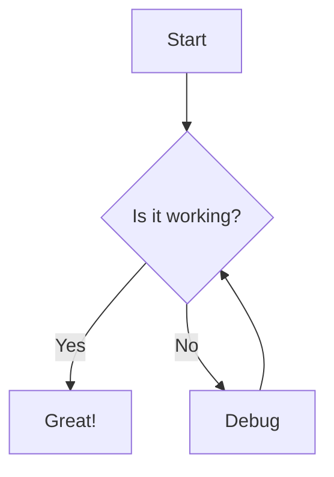
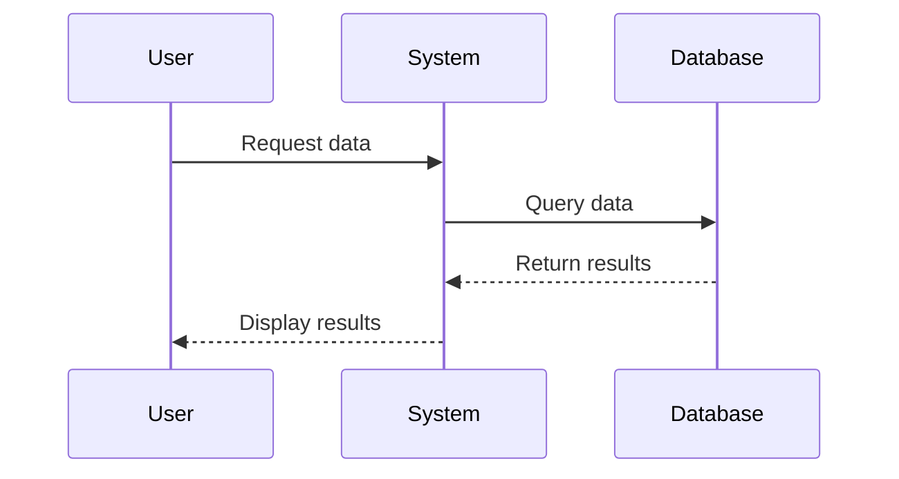
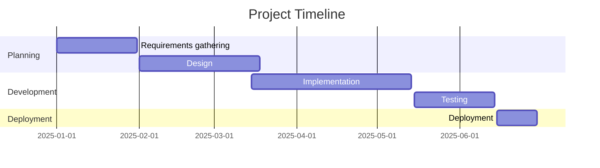

# Dynamic Content and Interactive Elements Test

This document tests how the UI handles dynamic content, interactive elements, and content that might be generated or modified at runtime.

## Template Variables and Expressions

### Basic Variables

Current Date: {{ date }}

Document Title: {{ title }}

Author: {{ author }}

Version: {{ version }}

### Conditional Content


**DRAFT DOCUMENT - NOT FOR DISTRIBUTION**

**FINAL VERSION - APPROVED FOR DISTRIBUTION**


### Loops and Iterations

#### Task List


- [ ] {{ task.name }} (Due: {{ task.dueDate }})


#### Team Members


- **{{ member.name }}** - {{ member.role }}
  - Email: {{ member.email }}
  - Projects: {{ member.projects.join(", ") }}


## Interactive Elements (if supported)

### Checkboxes

- [ ] Unchecked item 1
- [ ] Unchecked item 2
- [x] Checked item 1
- [x] Checked item 2
- [ ] Unchecked item with **formatted** *text*

### Collapsible Sections (if supported)

<details>
<summary>Click to expand this section</summary>

This content should be hidden by default and only shown when the user clicks on the summary.

It can contain any markdown elements:

- Lists
- **Bold text**
- *Italic text*
- `Code blocks`
- And more...

</details>

<details>
<summary>Another expandable section</summary>

This is another expandable section with different content.

```javascript
function expandableCode() {
  console.log("This code is inside an expandable section");
}
```

</details>

### Interactive Calculations (if supported)

Calculate: {{ 5 + 10 * 2 }} = 25

Current timestamp in milliseconds: {{ Date.now() }}

Random number between 1 and 100: {{ Math.floor(Math.random() * 100) + 1 }}

### User Input Fields (if supported)

Name: [                    ]

Email: [                    ]

Feedback:
[                           ]
[                           ]

### Tabs (if supported)

<div class="tabs">
  <div class="tab" data-tab="tab1">Tab 1</div>
  <div class="tab" data-tab="tab2">Tab 2</div>
  <div class="tab" data-tab="tab3">Tab 3</div>
  
  <div class="tab-content" id="tab1">
    <h3>Content for Tab 1</h3>
    <p>This is the content that should be shown when Tab 1 is active.</p>
  </div>
  
  <div class="tab-content" id="tab2">
    <h3>Content for Tab 2</h3>
    <p>This is the content that should be shown when Tab 2 is active.</p>
  </div>
  
  <div class="tab-content" id="tab3">
    <h3>Content for Tab 3</h3>
    <p>This is the content that should be shown when Tab 3 is active.</p>
  </div>
</div>

## Dynamic References

### Table of Contents (auto-generated)

[TOC]

### Footnotes (auto-numbered)

This is text with a footnote[^1].

This is text with another footnote[^2].

This is text with a named footnote[^note].

[^1]: This is the first footnote.
[^2]: This is the second footnote.
[^note]: This is a named footnote.

### Bibliography (auto-formatted)

According to Smith et al. [@Smith2023], the results were significant.

Jones [-@Jones2022] found similar patterns in earlier studies.

Multiple studies [@Smith2023; @Jones2022; @Brown2021] support this conclusion.

## Dynamic Content Generation

### Automatically Generated Tables

| ID | Name | Value | Calculated |
|----|------|-------|------------|

| {{ i }} | Item {{ i }} | {{ i * 10 }} | {{ i * i }} |


### Charts and Graphs (if supported)

```chart
type: bar
labels: [January, February, March, April, May]
series:
  - name: Series 1
    data: [10, 15, 8, 12, 9]
  - name: Series 2
    data: [5, 8, 12, 7, 11]
```

```chart
type: line
labels: [2020, 2021, 2022, 2023, 2024, 2025]
series:
  - name: Revenue
    data: [50, 65, 80, 95, 115, 140]
  - name: Expenses
    data: [45, 55, 65, 75, 85, 95]
```

```chart
type: pie
labels: [Category A, Category B, Category C, Category D]
series: [30, 25, 20, 25]
```

### Mermaid Diagrams (if supported)







## Live Data (if supported)

### Current Time

The current time is: {{ new Date().toLocaleTimeString() }}

### Weather Information

Current temperature in New York: {{ weather.newyork.temperature }}°C

Current temperature in London: {{ weather.london.temperature }}°C

Current temperature in Tokyo: {{ weather.tokyo.temperature }}°C

### Stock Prices

AAPL: ${{ stocks.AAPL }}

MSFT: ${{ stocks.MSFT }}

GOOG: ${{ stocks.GOOG }}

## Content That Updates on Events (if supported)

### Click Counter

Clicks: {{ clickCount }}

<button onclick="incrementClickCount()">Click me</button>

### Text Input Echo

<input type="text" id="echoInput" placeholder="Type something..." onkeyup="updateEcho()">

Echo: <span id="echoOutput"></span>

### Timer

<button onclick="startTimer()">Start Timer</button>
<button onclick="stopTimer()">Stop Timer</button>

Time elapsed: <span id="timerOutput">0</span> seconds

## Embedded Applications (if supported)

### Calculator

<div class="calculator">
  <input type="text" id="calculatorDisplay" readonly>
  <div class="calculator-buttons">
    <button onclick="calculatorClear()">C</button>
    <button onclick="calculatorAppend('7')">7</button>
    <button onclick="calculatorAppend('8')">8</button>
    <button onclick="calculatorAppend('9')">9</button>
    <button onclick="calculatorAppend('+')">+</button>
    <button onclick="calculatorAppend('4')">4</button>
    <button onclick="calculatorAppend('5')">5</button>
    <button onclick="calculatorAppend('6')">6</button>
    <button onclick="calculatorAppend('-')">-</button>
    <button onclick="calculatorAppend('1')">1</button>
    <button onclick="calculatorAppend('2')">2</button>
    <button onclick="calculatorAppend('3')">3</button>
    <button onclick="calculatorAppend('*')">*</button>
    <button onclick="calculatorAppend('0')">0</button>
    <button onclick="calculatorAppend('.')">.</button>
    <button onclick="calculatorCalculate()">=</button>
    <button onclick="calculatorAppend('/')">/</button>
  </div>
</div>

### Todo List

<div class="todo-app">
  <input type="text" id="todoInput" placeholder="Add a new task...">
  <button onclick="addTodo()">Add</button>
  <ul id="todoList">
    <li>
      <input type="checkbox"> Initial task
      <button onclick="removeTodo(this)">Delete</button>
    </li>
  </ul>
</div>

## Dynamic Content Resources

- [[#Template Variables and Expressions|Template Variables]]
- [[#Interactive Elements (if supported)|Interactive Elements]]
- [[#Dynamic References|Dynamic References]]
- [[#Dynamic Content Generation|Content Generation]]
- [[#Live Data (if supported)|Live Data]]

---

*This document is for testing purposes and contains examples of dynamic and interactive content to test UI rendering capabilities.*
